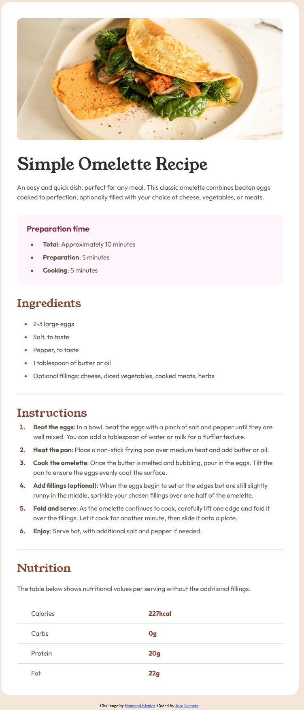

# Frontend Mentor - Recipe page solution

This is a solution to the [Recipe page challenge on Frontend Mentor](https://www.frontendmentor.io/challenges/recipe-page-KiTsR8QQKm). Frontend Mentor challenges help you improve your coding skills by building realistic projects. 

## Table of contents

- [Overview](#overview)
  - [The challenge](#the-challenge)
  - [Screenshot](#screenshot)
  - [Links](#links)
- [My process](#my-process)
  - [Built with](#built-with)
  - [What I learned](#what-i-learned)
  - [Continued development](#continued-development)
  - [Useful resources](#useful-resources)
- [Author](#author)

## Overview

### Screenshot



### Links

- Solution URL: [Add solution URL here](https://your-solution-url.com)
- Live Site URL:(https://josenegrete123.github.io/Recipe-Page-Project/)

## My process

### Built with

- Semantic HTML5 markup
- CSS custom properties
- Flexbox

### What I learned

Learned how to work with lists and tables. Had some difficulty figuring out how to changed aspects of both lists and tables.

```html
<ul class="card__text__preparation__list">
  <li class="card__text__preparation__list__item"><span class="first-word">Total</span>: Approximately 10 minutes</li>
  <li class="card__text__preparation__list__item"><span class="first-word">Preparation</span>: 5 minutes</li>
  <li class="card__text__preparation__list__item"><span class="first-word">Cooking</span>: 5 minutes</li>
</ul>

<table class="card__text__nutrition__table">
  <tbody class="card__text__nutrition__table__body">
    <tr class="card__text__nutrition__table__body__row">
      <th class="card__text__nutrition__table__body__row__title">Calories</th>
      <td class="card__text__nutrition__table__body__row__detail">227kcal</td>
    </tr>
  </tbody>
</table>
```
```css
.card__text__preparation li::marker {
    color: var(--rose-800);
}

.card__text__preparation .first-word {
    font-family: "Outfit";
    font-style: normal;
    font-weight: 700;
    font-size: 16px;
    line-height: 150%;
}
```
### Continued development

For the future I want to focus on how to better utilize tables and lists. I also need to work more on writing better semantic HTML.

### Useful resources

- [Nth-Child](https://stackoverflow.com/questions/15603957/css-select-all-child-elements-except-first-two-and-last-two) - This helped me target the second child of a table to add the lines in between.
- [Bold first word](https://stackoverflow.com/questions/7440572/css-bold-first-word) - This helped me bold the first word of specific lists.

## Author

- GitHub - [Jose Negrete](https://github.com/josenegrete123)
- Frontend Mentor - [@josenegrete123](https://www.frontendmentor.io/profile/josenegrete123)